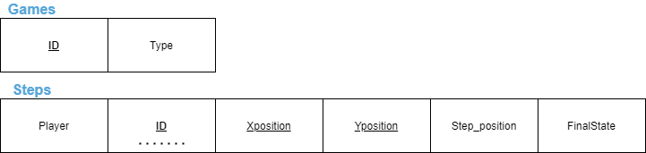
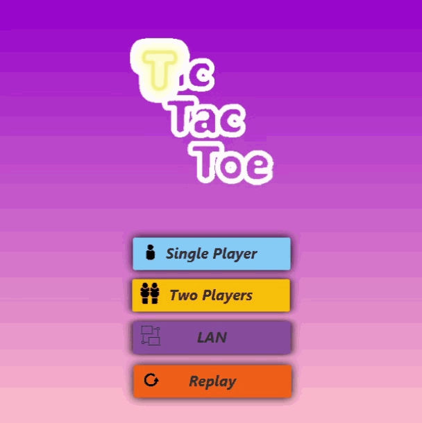
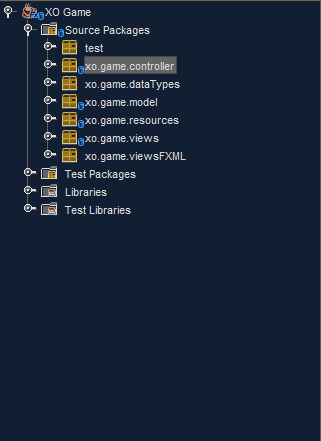

# Java TicTacToe Game :x: :o:

 This is our final version of the TicTacToe Game, We will be discussing all the implementation designs in this readme.  
 The game is submitted as the final project for the Java course offered by the information technology institute (ITI).

# Table of Contents  
<!--- ### Place 2
Place one has the fun times of linking here, but I can also link back [here](#place-1).-->
- ### [Introduction](#Introduction) :microphone:
- ### [Database Design](#Database-Design) :floppy_disk:
   <!-- Class Diagram-->
- ### [GUI](#GUI) :dress:
- ### [Game Modes](#Game-Modes) :soccer:
  - ### [Single Player](#Single-Player) :raising_hand:
  - ### [Two Player](#Two-Player) :raising_hand: :computer: :raising_hand:
  - ### [LAN Games](#LAN) :smirk_cat: :computer: :computer: :smirk_cat:
  - ### [Replays](#Replay) :repeat:
- ### [Design Patterns](#Design-Patterns) :recycle: 
- ### [MinMax Algorithm](#MinMax-Algorithm) :triangular_ruler:
- ### [The Extra Mile](#The-Extra-Mile) :runner:

# Introduction

The application requirements stated that the game should offer multiple game modes from single player, two players, LAN games, The requirements also stated that replays of the played games should be supported and should be emulated based on the steps played in that particular game  

So we made the application following the requirements and we will be discussing it thoroughly as we dive deeper into the readme with codes and screenshots, Let's begin.  


# Database Design
The Database didn't need to be anything complex we just had to set up two tables one to hold the games and one to hold the steps to each game this was the mapping of both of these tables



The ID signifies the ID of the game... duh :information_desk_person:, The type signifies if the game is single player, two players or LAN  

The second table has the ID as foreign key with the X & Y positions as combined primary key marking the position of the play on the board.  

The step position works as the ordering column for these plays concerning a single game while the player column signifies if player was an X or an O where X is 1 and O is 0  

The final state column signifies if the game ended in a win or lose or a draw, **Notice that** the win or lose condition are solely based around player 1 as the original user of the application. The final state is 10 as long as the game is running and is **1** for win **-1** for lose and **0** for draw  

The database is made in MySQL and you an find the the SQL file in the repo just import it and you will be solid :ok_hand:  

# GUI
The GUI had a lot of emphasis in the requirements so we took great care to make it look as good as possible check it out below :point_down:  
<p align="center">
     
</p>
I know.. I kinda suck at editing :man_facepalming: so anyway. pretty self explanatory up till now you just choose which game mode you like to play and you jump right in the game  

# Game Modes
Now we can jump into a little bit of game play we will be discussing each game mode and first we have is.....

## Single Player

For all the people that have no friends out there worry no more there is an AI algorithm that can make you lose every game you play against him isn't that sweet :cupid:  

So the single player has two modes ***Dumb*** and ***Mega smart*** the Dumb one just chooses a random empty tile that it can play in while on the other hand the Mega smart chooses the best play it can play using the MinMax algorithm (we'll talk about that later on) to win or at the very least default the game to a draw  

This is a game play of the Mega smart single player the game is set to play on the hardest difficulty by default but we can add a difficulty chooser to it :point_down:

<p align="center">
     
</p>
So I was actually planning to go for a draw but looks like i missed it :neutral_face:  

But anyway you get the idea you can't win the AI not in a game with branching factor of 9

## Two Player

Two player game mode allows a couple of people on the same machine to play a quality game of TicTacToe.. guess I will win this time won't I hehe :sunglasses:  

<p align="center">
     
</p>

So the only thing we are missing in these gifs is the alert pop ups after every game there are two alerts one asks if you want to save the game and the other asks if you want to play again  


## LAN 

Since I can't really capture the LAN game and show it in a good way let me explain the code for it  

<p align="center">
       
</p>
Basically what happens is that you enter to a menu and asks if you want to host or join a game, Our implementation works on a peer-to-peer basis that is  

If you choose to host a game the app will block for 5 seconds looking for someone broadcasting a *Game Request* in the local network over a specific port  

If it finds such a request it sends the IP and port as a string to the broadcaster then initiates a server socket on this particular port to accept incoming connections  

The broadcaster then parses the string and tries to connect to the socket of the host and once the connection is established the game starts  

The board blocks for the joiner and opens for the host to play with a thread listener for incoming events if game ended if disconnected and such scenarios

 ```
 Host initial socket

 receiveSocket.bind(new InetSocketAddress(InetAddress.getByName("0.0.0.0"), 8002));

------------------------------------------------------------------------------------

 Joiner initial socket

 DatagramPacket packet = new DatagramPacket(data, data.length, InetAddress.getByName("255.255.255.255"), 8002); 
```

## Replay


**Note that** if you don't have a database or the server is off it will block for a few seconds then resume I will add an audio describing the problem in the catch statement later  

Replays are pretty straight forward you call the model get the games you have in the database you choose a game then it automatically calls the model again to get the steps for that game and plays it on a board one by one emulating the game plain and simple :point_down:

<p align="center">
     
</p>

and that's it for the projects use cases and functionalities we talked a lot but now we can discuss some important stuff which are designs and the algorithm used in the AI 

# Design Patterns

We implemented a couple of design patterns in the project which are ***MVC*** and ***Singleton***  

Each game mode was a view of its own so we needed a board for each of them but a single board with a single controller throughout the lifetime of the app that's why we implemented the singleton as follows :point_down:

```
 private static SinglePlayerController SPC;

 public static SinglePlayerController getInstance() {
        if (SPC == null) {
            synchronized (SinglePlayerController.class) {
                if (SPC == null) {
                    SPC = new SinglePlayerController();
                }
            }
        }
        return SPC;
    }
```

This made the follow a lot easier where we can change the scenes and reference controllers easily where they should work  

The controllers worked as glass viewer between the view and the controller carrying all the logic of the game and handling the view's logic to be drawn or appended to the view and the database's logic to the model  

The only thing that needed improvement was the actual architecture of the project as it could've been segregated but by the time I realized that it was too late to do any changes so I left it as is  

We separated classes that are categorically relevant into their own packages for use of readability 

<p align="center">
     
</p>

- test: is just where I tested stuff and played around in the project
- dataTypes: is where we put our moves and Games-Holder classes that we used as custom data types for the project
- resources: are the pictures and sounds used in the project along with the CSS and icons
- viewsFXML: is where we put the base view classes before generating classes we used the scene builder for that
- views: is where our working views and scenes reside
- controller: is where the programs logic and work flow is 
- model: is where the database connection logic resides


# MinMax Algorithm

Now that we are finally here we can talk a bit about the algorithm that is winning over us every time for more in depth information about it I recommend reading [this](https://towardsdatascience.com/understanding-the-minimax-algorithm-726582e4f2c6) article  

But essentially what it does is that it takes the current state of the game and mocks it. That is it simulates every possible move and tries to maximize the output for a player in our case the computer and minimize the output to the other in our case the human  

It's a recursive algorithm so it might look a bit complicated but it actually is very simple we'll break it down to steps then we'll review the code  

- For the computer it initialize a very low score
- Mocks the game state with a random play
- See if it gets a better score than it already has
- and takes the maximum of both scores  

<p>&nbsp;</p>
<p>&nbsp;</p>

- As for the other player it initialize a very high score
- Mocks the game state with a random play
- see if it gets a lower score than it already has
- and takes the minimum for both

aaaaand repeat...  

Basically that's it you can never win since it goes through all the branches and thinks of all the outcomes the branching factor of the tic tac toe isn't that big it's only 9 while chess for instance has a branching factor of 35 and that's a lot :dizzy_face:  

Checkout the code for Maximizer below :point_down:

```
int best = -1000;
            for (int i = 0; i < 3; i++) {
                for (int j = 0; j < 3; j++) {
                    if (localGameState[i][j] == 0) {
                        localGameState[i][j] = -1;
                        best = Math.max(best, minMax(localGameState,
                                depth + 1, !isComputer));
                        localGameState[i][j] = 0;
                    }
                }
            }
            return best;
```

and the Minimizer code is :point_down:

```
      int best = 1000;
            for (int i = 0; i < 3; i++) {
                for (int j = 0; j < 3; j++) {
                    if (localGameState[i][j] == 0) {
                        localGameState[i][j] = 1;
                        best = Math.min(best, minMax(localGameState,
                                depth + 1, !isComputer));
                        localGameState[i][j] = 0;
                    }
                }
            }
            return best;
```


# The Extra Mile

What we could've done more is of course segregate the controllers and views to a common parent also we could've put a parent controller to be called for all the common operations instead of being an abstract  

Probably much more as there is still room for improvement nevertheless the app works fine and should be delivered properly on time.  

Hope I was as descriptive as possible and everything in the app came to light if there are any questions you can contact me here or any of the team members who worked on this app


